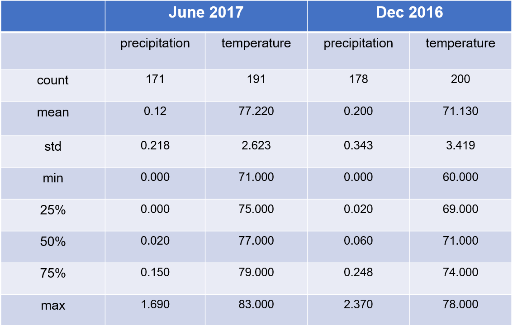

# Surfs Up
Weather Analysis for surfing and ice cream shop business

## Project Overview
This project involves gathering data on the seasons of Oahu and determining whether the seasons could affect the surf and ice cream shop business.
Specifically, are there certain times of the year when business might be slower, or the type of customer could be different?

## Tools
Python, SQLite, SQLAlchemy, Flask

## Summary

### The June-2017 and December-2016 key statistical data across all of the stations has been shown below:

### As per the above table, the observations are :

- The minimum, mean and maximum temperatures in June(summer) is more than that of December(winter), which is suitable for the 
	surfing and ice-cream shop. The standard deviation in temperature for June  is less than that of December.

- Also, the mean and maximum precipitation in June is less than that of December, which is suitable for the surfing and 
   ice-cream shop. The standard deviation in precipitation for June  is less than that of December. 

- The counts of precipitation and temperature for the month of June is also less than that of December. Because of the
	more standard deviation in the month of December, the weather across all the stations varies more as compared to the 
	month of June. 

- As per the above observations, the surfing and ice-cream shop will make more profit in the month of June as compared to the 
	month of December.

## Recommendations 

- For further analysis, we should increase our range of summer and winter months for a better and indepth analysis.

- We can also do a seperate analysis for the best stations using some kind of filter like based on the total number of observations.

- We can also drop the stations which are outliers in terms of data for our analysis.